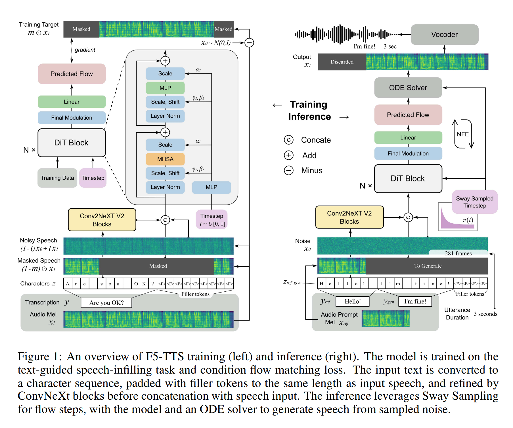

# F5-TTS-Vietnamese


A fine-tuning pipeline for training a Vietnamese speech synthesis model using the F5-TTS architecture.

Try demo at: https://huggingface.co/spaces/hynt/F5-TTS-Vietnamese-100h

## Tips for training
- 100 hours of data is generally sufficient to train a Vietnamese Text-to-Speech model for specific voices. However, to achieve optimal performance in voice cloning across a wide range of speakers, a larger dataset is recommended. I fine-tuned an F5-TTS model on approximately 1000 hours of data, which resulted in excellent voice cloning performance.
- Having a large amount of speaker hours with highly accurate transcriptions is crucial — the more, the better. This helps the model generalize better to unseen speakers, resulting in lower WER after training and reducing hallucinations.

## Tips for inference
- It is recommended to select sample audios that are clear and have minimal interruptions, and should be less than 10 seconds long, as this will improve the synthesis results.
- If the reference audio text is not provided, the default model used will be whisper-large-v3-turbo. Consequently, Vietnamese may not be accurately recognized in some cases, which can result in poor speech synthesis quality.
- In case you want to synthesize speech from a long text paragraph, it is recommended to replace the chunks function (located in **src/f5_tts/infer/utils_infer.py**) with the modified chunk_text function below:

```bash
def chunk_text(text, max_chars=135):
    sentences = [s.strip() for s in text.split('. ') if s.strip()]
    i = 0
    while i < len(sentences):
        if len(sentences[i].split()) < 4:
            if i == 0:
                # Merge with the next sentence
                sentences[i + 1] = sentences[i] + ', ' + sentences[i + 1]
                del sentences[i]
            else:
                # Merge with the previous sentence
                sentences[i - 1] = sentences[i - 1] + ', ' + sentences[i]
                del sentences[i]
                i -= 1
        else:
            i += 1

    final_sentences = []
    for sentence in sentences:
        parts = [p.strip() for p in sentence.split(', ')]
        buffer = []
        for part in parts:
            buffer.append(part)
            total_words = sum(len(p.split()) for p in buffer)
            if total_words > 20:
                # Split into separate chunks
                long_part = ', '.join(buffer)
                final_sentences.append(long_part)
                buffer = []
        if buffer:
            final_sentences.append(', '.join(buffer))

    if len(final_sentences[-1].split()) < 4 and len(final_sentences) >= 2:
        final_sentences[-2] = final_sentences[-2] + ", " + final_sentences[-1]
        final_sentences = final_sentences[0:-1]

    return final_sentences
```

## Installation

### Create a separate environment if needed

```bash
# Create a python 3.10 conda env (you could also use virtualenv)
conda create -n f5-tts python=3.10
conda activate f5-tts
```

### Install PyTorch

> ```bash
> # Install pytorch with your CUDA version, e.g.
> pip install torch==2.4.0+cu124 torchaudio==2.4.0+cu124 --extra-index-url https://download.pytorch.org/whl/cu124
> ```

### Install f5-tts module:

> ```bash
> cd F5-TTS-Vietnamese
> pip install -e .
> ```

### Install sox, ffmpeg

> ```bash
> sudo apt-get update
> sudo apt-get install sox ffmpeg
> ```

## Fine-tuning pipline

Steps:

- Prepare `audio_name` and corresponding transcriptions  
- Add missing vocabulary from your dataset to the pretrained model  
- Expand the model's embedding to support the updated vocabulary  
- Perform feature extraction  
- Fine-tune the model

```bash
bash fine_tuning.sh
```

### Inference

```bash
bash infer.sh
```

### References

- Original F5-TTS repository: [https://github.com/SWivid/F5-TTS](https://github.com/SWivid/F5-TTS)